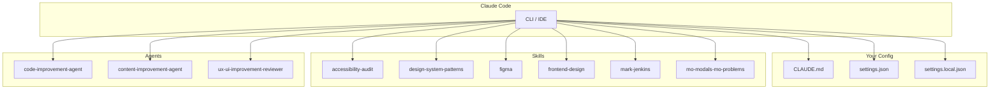

# Claude Code Configuration

Personal Claude Code configuration including CLAUDE.md instructions, custom skills, and agents.

## Structure

```
claude-environment/
├── CLAUDE.md              # Your personal instructions
├── settings.json           # Enabled plugins
├── settings.local.json     # Permissions & allowances
├── skills/
│   ├── accessibility-audit/
│   ├── design-system-patterns/
│   ├── figma/
│   ├── frontend-design/
│   ├── mark-jenkins/
│   └── mo-modals-mo-problems/
└── agents/
    ├── code-improvement-agent.md
    ├── content-improvement-agent.md
    └── ux-ui-improvement-reviewer.md
```

### Visual Overview



## Contents

### CLAUDE.md
Personal instructions for Claude Code - workflow orchestration, task management, and core principles.

### Settings Files
- `settings.json` - Enabled plugins
- `settings.local.json` - Local permissions and custom allowances

### Skills (`skills/`)
- `accessibility-audit/` - WCAG compliance auditing
- `design-system-patterns/` - Design token and design system building
- `figma/` - Figma integration for design-to-code
- `frontend-design/` - Production-grade frontend interfaces
- `mark-jenkins/` - Personal portfolio skill for design leadership
- `mo-modals-mo-problems/` - "Mo Modals Mo Problems" - when to use/avoid modals

### Agents (`agents/`)
- `code-improvement-agent.md` - Code readability, performance, best practices
- `content-improvement-agent.md` - Documentation and content quality
- `ux-ui-improvement-reviewer.md` - UX/UI review for frontend code

## Installation

```bash
# Clone the repo
git clone https://github.com/markj81/claude-environment.git ~/.claude

# Or copy specific files:
cp CLAUDE.md ~/.claude/
cp settings*.json ~/.claude/
cp -r skills/ ~/.claude/
cp -r agents/ ~/.claude/
```
